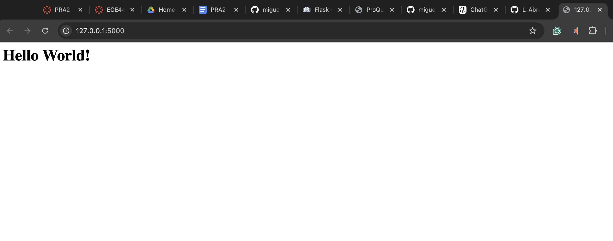

# E444-F2024-PRA2

**Author:** Liza Abraham

This repository is a clone of https://github.com/miguelgrinberg/flasky. The source code is used for educational purposes.

## Flask Activity 1.2

## Flask Activity 1.3 and 1.4

## Docker Activity 2.2

## Docker Activity 2.4
